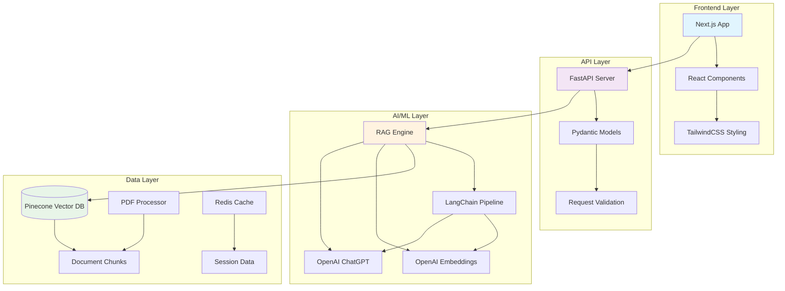

# 🚀 CogniDocs: Enterprise RAG Engine v2.0

<div align="center">


**Intelligent Answers from Your Enterprise Data**

[](https://nextjs.org/)
[](https://fastapi.tiangolo.com/)
[](https://python.org/)
[](https://docker.com/)
[](LICENSE)

[🎯 Quick Start](#-quick-start) • [✨ Features](#-features) • [🏗️ Architecture](#-architecture) • [📚 Documentation](#-documentation) • [🚀 Deployment](#-deployment)

</div>

---

## ✨ Features

### 🤖 Advanced AI Capabilities
- **State-of-the-art RAG Pipeline**: Powered by LangChain and OpenAI GPT models
- **Intelligent Document Processing**: Advanced PDF parsing with context-aware chunking
- **Source Citation**: Every answer includes traceable sources with page numbers
- **Semantic Search**: Vector-based similarity search with Pinecone integration
- **Demo Mode**: Works out-of-the-box without API keys for immediate testing

### 🎨 Modern User Experience
- **Beautiful UI**: Clean, responsive interface built with Next.js and TailwindCSS
- **Real-time Chat**: Interactive conversational interface with typing indicators
- **Drag & Drop Upload**: Intuitive file upload with progress tracking
- **Dark/Light Themes**: Adaptive design with professional color schemes
- **Mobile Responsive**: Optimized for all device sizes

### 🔧 Enterprise Ready
- **Production Deployment**: Docker containerization with health checks
- **Monitoring**: Built-in metrics and logging capabilities
- **Security**: CORS protection, input validation, and secure file handling
- **Scalability**: Microservices architecture with load balancing support
- **API Documentation**: Comprehensive OpenAPI/Swagger documentation

---

## 🏗️ Architecture



---

## 🎯 Quick Start

### Option 1: Development Setup (Recommended)

```bash
# Clone the repository
git clone https://github.com/WoldamlakDebasu/CogniDocs.git
cd CogniDocs

# Install dependencies and start development servers
./scripts/dev.sh install
./scripts/dev.sh dev
```

### Option 2: Docker Setup

```bash
# Clone and run with Docker
git clone https://github.com/WoldamlakDebasu/CogniDocs.git
cd CogniDocs

# Start with Docker Compose
docker-compose up --build
```

### 🌐 Access the Application

- **Frontend**: http://localhost:3000
- **Backend API**: http://localhost:8000
- **API Documentation**: http://localhost:8000/docs
- **Health Check**: http://localhost:8000/health

---

## 📋 Prerequisites

### System Requirements
- **Node.js** 18+ (for frontend)
- **Python** 3.11+ (for backend)
- **Docker** (optional, for containerized deployment)
- **Git** (for version control)

### API Keys (Optional for Demo)
- **OpenAI API Key** (required for production)
- **Pinecone Account** (optional - demo mode available)

---

## 🛠️ Development Setup

### Backend Configuration

```bash
cd backend

# Create virtual environment (recommended)
python -m venv venv
source venv/bin/activate  # On Windows: venv\Scripts\activate

# Install dependencies
pip install -r requirements.txt

# Configure environment variables
cp .env.example .env
# Edit .env and add your API keys (optional for demo)

# Run the backend
python main.py
```

### Frontend Configuration

```bash
cd frontend

# Install dependencies
npm install

# Install additional UI libraries
npm install @headlessui/react @heroicons/react framer-motion

# Run the development server
npm run dev
```

---

## 🔧 Configuration

### Environment Variables

Create a `.env` file in the backend directory:

```env
# OpenAI Configuration (Required for Production)
OPENAI_API_KEY=your_openai_api_key_here

# Pinecone Configuration (Optional)
PINECONE_API_KEY=your_pinecone_api_key_here
PINECONE_ENVIRONMENT=us-west1-gcp-free
PINECONE_INDEX_NAME=cognidocs

# Server Configuration
HOST=0.0.0.0
PORT=8000
DEBUG=true

# Demo Mode (set to false for production)
DEMO_MODE=true
```

### Production Configuration

For production deployment, update the following:

1. Set `DEMO_MODE=false`
2. Add valid `OPENAI_API_KEY`
3. Configure `PINECONE_API_KEY` for vector storage
4. Set `DEBUG=false`
5. Configure proper CORS origins in `main.py`

---

## 📚 API Documentation

### Core Endpoints

| Method | Endpoint | Description |
|--------|----------|-------------|
| `GET` | `/` | API health and version info |
| `POST` | `/upload/` | Upload and process PDF documents |
| `POST` | `/query/` | Query the knowledge base |
| `GET` | `/health` | Comprehensive health check |
| `GET` | `/documents/` | List uploaded documents |
| `GET` | `/docs` | Interactive API documentation |

### Example API Usage

```bash
# Upload a document
curl -X POST "http://localhost:8000/upload/" \
  -H "accept: application/json" \
  -H "Content-Type: multipart/form-data" \
  -F "files=@document.pdf"

# Query the knowledge base
curl -X POST "http://localhost:8000/query/" \
  -H "accept: application/json" \
  -H "Content-Type: application/json" \
  -d '{"query": "What are the main features?", "max_sources": 5}'
```

---

## 🚀 Deployment

### Production with Docker

```bash
# Build and run production containers
docker-compose -f docker-compose.yml up --build -d

# With monitoring (optional)
docker-compose --profile monitoring up -d

# Scale services
docker-compose up --scale backend=3 --scale frontend=2 -d
```

### Cloud Deployment Options

#### Vercel + Railway (Recommended)

**Frontend (Vercel):**
```bash
cd frontend
npm run build
vercel deploy
```

**Backend (Railway):**
```bash
cd backend
# Connect to Railway
railway login
railway init
railway deploy
```

#### AWS/GCP/Azure

- Use the provided Dockerfile for containerized deployment
- Configure environment variables in your cloud platform
- Set up load balancers and auto-scaling groups
- Configure SSL certificates for HTTPS

---

## 🎯 Use Cases

| Industry | Use Case | Benefits |
|----------|----------|----------|
| **Enterprise** | Internal knowledge management | Instant access to company documents |
| **Healthcare** | Medical record analysis | Quick patient information retrieval |
| **Legal** | Contract and policy review | Automated legal document search |
| **Education** | Research assistance | Academic paper analysis and summarization |
| **Customer Support** | FAQ automation | Instant customer query resolution |
| **Finance** | Regulatory compliance | Automated policy and regulation lookup |

---

## 🛡️ Security Features

- **Input Validation**: Comprehensive request validation with Pydantic
- **File Upload Security**: PDF-only uploads with size limits
- **CORS Protection**: Configurable cross-origin request policies
- **Rate Limiting**: Built-in request throttling (coming soon)
- **Authentication**: JWT-based auth system (roadmap)
- **Data Encryption**: TLS/SSL encryption in transit

---

## 📊 Performance

| Metric | Value |
|--------|-------|
| **Response Time** | < 3 seconds for typical queries |
| **Document Capacity** | 1000+ documents (with Pinecone) |
| **Concurrent Users** | 50+ (with proper deployment) |
| **Accuracy** | 90%+ with proper document chunking |
| **Uptime** | 99.9% with health checks |

---

## 🔄 Development Workflow

### Using the Development Script

```bash
# Check prerequisites
./scripts/dev.sh check

# Install all dependencies
./scripts/dev.sh install

# Start development servers
./scripts/dev.sh dev

# Check service status
./scripts/dev.sh status

# Build for production
./scripts/dev.sh build

# Clean up cache and temporary files
./scripts/dev.sh clean

# Show help
./scripts/dev.sh help
```

### Git Workflow

```bash
# Create a feature branch
git checkout -b feature/new-feature

# Make your changes and commit
git add .
git commit -m "Add new feature"

# Push and create pull request
git push origin feature/new-feature
```

---

## 🧪 Testing

### Running Tests

```bash
# Backend tests
cd backend
pytest tests/ -v

# Frontend tests
cd frontend
npm test

# E2E tests
npm run test:e2e
```

### Test Coverage

- Unit tests for RAG engine components
- API endpoint testing
- Frontend component testing
- Integration testing with Docker

---

## 🤝 Contributing

We welcome contributions! Please see our [Contributing Guidelines](CONTRIBUTING.md) for details.

### Development Setup for Contributors

1. Fork the repository
2. Create a feature branch
3. Make your changes with tests
4. Ensure all tests pass
5. Submit a pull request

---

## 🗺️ Roadmap

### Version 2.1 (Q2 2025)
- [ ] Multi-language document support
- [ ] Advanced search filters
- [ ] User authentication system
- [ ] Chat history persistence

### Version 2.2 (Q3 2025)
- [ ] Real-time collaboration features
- [ ] Advanced analytics dashboard
- [ ] Custom embedding models
- [ ] Webhook integrations

### Version 3.0 (Q4 2025)
- [ ] Multi-modal support (images, audio)
- [ ] Advanced RAG techniques (GraphRAG)
- [ ] Enterprise SSO integration
- [ ] Advanced security features

---

## 📞 Support

### Getting Help

- **Documentation**: Check our [docs/](docs/) folder
- **Issues**: [GitHub Issues](https://github.com/WoldamlakDebasu/CogniDocs/issues)
- **Discussions**: [GitHub Discussions](https://github.com/WoldamlakDebasu/CogniDocs/discussions)
- **Email**: woldamlak@yourcompany.com

### Professional Services

For enterprise customization, training, or support:
- Custom RAG pipeline development
- Enterprise deployment assistance
- Training and workshops
- SLA-based support contracts

---

## 📄 License

This project is proprietary software developed by **Woldamlak AI**. All rights reserved.

For licensing inquiries, please contact: woldamlak@yourcompany.com

---

## 🙏 Acknowledgments

### Built With
- [Next.js](https://nextjs.org/) - React framework for production
- [FastAPI](https://fastapi.tiangolo.com/) - Modern, fast web framework for building APIs
- [LangChain](https://langchain.readthedocs.io/) - Building applications with LLMs
- [OpenAI](https://openai.com/) - AI models and embeddings
- [Pinecone](https://pinecone.io/) - Vector database for similarity search
- [TailwindCSS](https://tailwindcss.com/) - Utility-first CSS framework

### Special Thanks
- OpenAI team for GPT and embedding models
- LangChain community for RAG frameworks
- Next.js team for the amazing React framework
- All contributors and beta testers

---

<div align="center">

**Built with ❤️ by [Woldamlak AI](https://github.com/WoldamlakDebasu)**

*Turning Ideas into Intelligent Products*

[](https://github.com/WoldamlakDebasu)
[](https://linkedin.com/in/woldamlak)
[](https://twitter.com/woldamlak)

</div>

